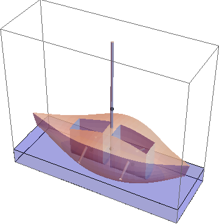

# boats
Mathematica code for Olin's Quantitative Engineering Analysis boats project.

Also contains OpenSCAD files for cutting the boat design into many 2-in pieces to be 3-axis milled.

I wouldn't use this code to try to do anything at all if you're not me, it's very much tailored to my setup, and would require lots of change to work on someone else's computer.

## What it can do

- Calculate the waterline of any* boat
- Find the AVS (angle of vanishing stability) of the boat, in any orientation (meaning it can calculate trim AVS)
- Generate pretty pictures of the boat
- Be the first real Mathematica program I've ever made
